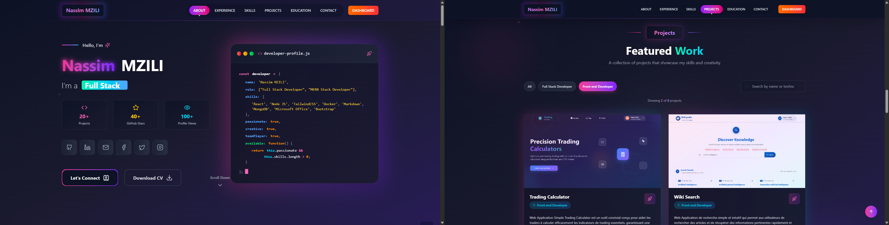
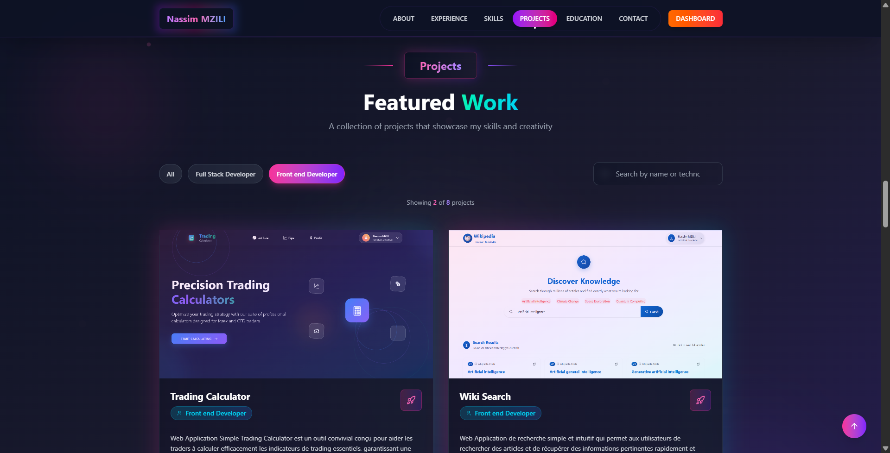
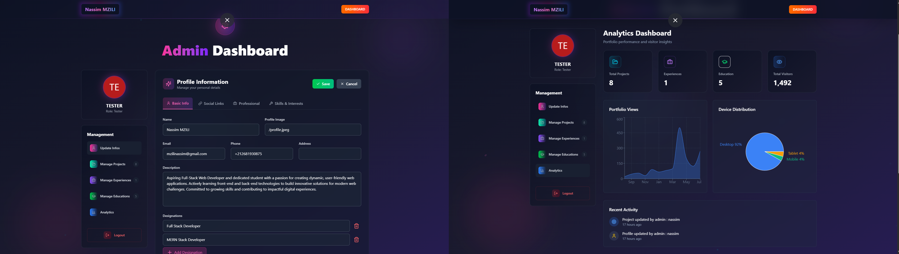
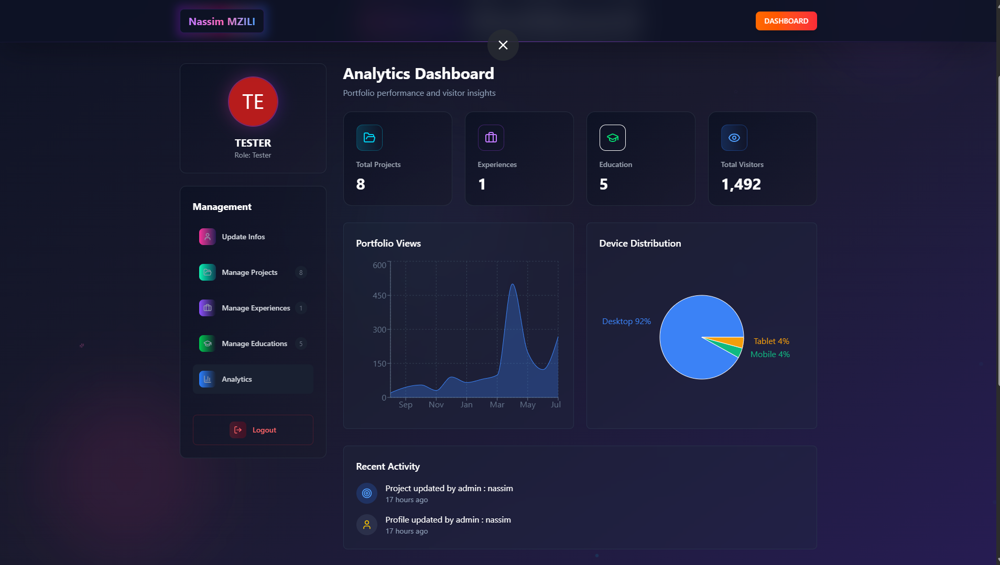
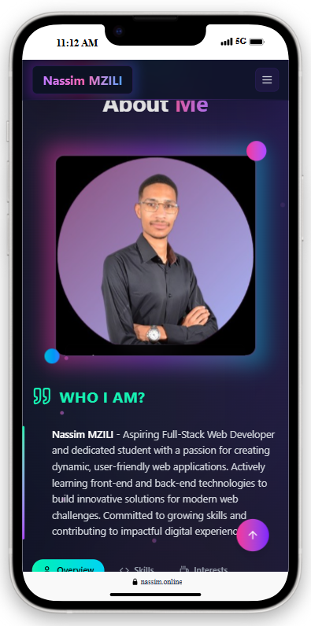
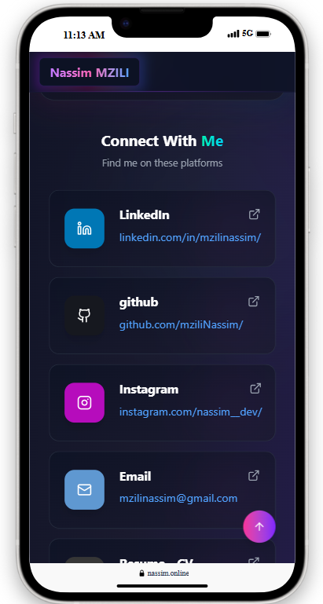

# Portfolio Website

A modern, full-stack portfolio website built with React and Node.js, featuring a comprehensive dashboard for content management and analytics.

## 🌐 Live Demo

- **index route / Website:** [https://nassim.online](https://nassim.online)
- **Links route :** [https://nassim.online/links](https://nassim.online/links)
- **cv route :** [https://nassim.online/cv](https://nassim.online/cv)
- **dashboard route :** [https://nassim.online/admin/dashboard](https://nassim.online/admin/dashboard)

## 📸 Project Preview

### Homepage


_Modern and responsive homepage with animated hero section_

### Portfolio Projects Section


_Interactive projects showcase with filtering capabilities_

### Admin Dashboard


_Comprehensive admin panel for content management_

### Analytics Dashboard


_Real-time visitor statistics and analytics charts_

### Mobile Responsive

<div align="center">
  
  
</div>

_Fully responsive design optimized for all devices_

## ✨ Features

### Frontend

- **Modern React Application** with React 19
- **Responsive Design** with Tailwind CSS 4
- **Type Animation Effects** for dynamic text display
- **Analytics Dashboard** with Recharts
- **Email Integration** with EmailJS
- **Toast Notifications** using Sonner
- **Image Compression** for optimized loading
- **Redux State Management**

### Backend

- **RESTful API** built with Express.js
- **MongoDB Database** with Mongoose ODM
- **JWT Authentication** for admin access
- **CORS Support** for cross-origin requests
- **Environment Configuration** with dotenv
- **Password Encryption** using bcryptjs

### Dashboard

- **Content Management System** for:
  - Personal information
  - Projects portfolio
  - Work experiences
  - Education history
- **Analytics Tracking** with visitor statistics
- **Secure Authentication** system
- **Real-time Data Updates**

## 🛠️ Tech Stack

### Frontend

- **React** 19.1.0 - UI library
- **Vite** 6.3.5 - Build tool
- **Tailwind CSS** 4.1.8 - Styling
- **React Router DOM** 7.6.2 - Routing
- **Redux Toolkit** 2.8.2 - State management
- **Recharts** 3.1.0 - Charts and analytics
- **Axios** 1.10.0 - HTTP client
- **EmailJS** 4.4.1 - Email service

### Backend

- **Node.js** - Runtime environment
- **Express.js** 5.1.0 - Web framework
- **MongoDB** with Mongoose 8.16.4 - Database
- **JWT** 9.0.2 - Authentication
- **bcryptjs** 3.0.2 - Password hashing
- **CORS** 2.8.5 - Cross-origin resource sharing

## 🚀 Installation & Setup

### Prerequisites

- Node.js (v16 or higher)
- MongoDB database
- npm or yarn package manager

### Clone Repository

```bash
git clone https://github.com/mziliNassim/my_portfolio.git
cd my_portfolio
```

### Backend Setup

1. Navigate to server directory:

```bash
cd server
```

2. Install dependencies:

```bash
npm install
```

3. Create `.env` file in the server directory:

```env
PORT=3000
MONGODB_URI=your_mongodb_connection_string # or mongodb://localhost:27017/portfolio
JWT_SECRET=your_jwt_secret_key
```

4. Start the server:

```bash
# Development
npm run dev

# Production
npm start
```

### Frontend Setup

1. Navigate to client directory:

```bash
cd client
```

2. Install dependencies:

```bash
npm install
```

3. Create `.env` file in the client directory:

```env
# EmailJs
VITE_EMAILJS_SERVICE_ID=your_emailjs_service_id
VITE_EMAILJS_TEMPLATE_ID=your_emailjs_template_id
VITE_EMAILJS_PUBLIC_KEY=your_emailjs_public_key


# Server
VITE_SERVER_URI=http://localhost:3000

# Envirement dev || prod
VITE_ENVIREMENT=dev
```

4. Start the development server:

```bash
npm run dev
```

## 📁 Project Structure

```txt
portfolio/
├── client/                 # Frontend React application
│   ├── public/
│   ├── src/
│   │   ├── assests/        #
│   │   ├── components/     # Reusable components
│   │   │   ├── dashboard/  # Admin dashboard components
│   │   │   ├── layouts/    # Layout components
│   │   │   ├── portfolio/  # Portfolio page components
│   │   │   └── styles/     # Styled components
│   │   ├── features/       # Redux slices
│   │   ├── helper/         #
│   │   ├── pages/          # Main page components
│   │   ├── styles/         #
│   │   ├── utils/          #
│   │   ├── App.jsx         #
│   │   └── main.jsx        #
│   ├── .env
│   ├── .env.example
│   ├── .gitignore
│   ├── eslint.comfig.js
│   ├── index.js
│   ├── package-lock.json
│   ├── package.json
│   └── vite.config.js
├── server/                 # Backend Node.js application
│   ├── config/             # Database configuration
│   ├── controllers/        #
│   ├── middleware/         # Custom middleware
│   ├── models/             # Database models
│   ├── routes/             # API routes
│   ├── scripts/            #
│   ├── .env
│   ├── .env.example
│   ├── .gitignore
│   ├── index.js
│   ├── package-lock.json
│   ├── package.json
│   └── vercel.json         # Vercel deployment config
└── README.md               #
```

## 🔧 Available Scripts

### Frontend (Client)

```bash
npm run dev      # Start development server
npm run build    # Build for production
npm run preview  # Preview production build
npm run lint     # Run ESLint
```

### Backend (Server)

```bash
npm start        # Start production server
npm run dev      # Start development server with nodemon
```

## 🌐 Deployment

### Frontend Deployment (Netlify)

The frontend is deployed on Netlify and accessible at [https://nassim.online](https://nassim.online)

### Backend Deployment (Vercel)

The backend is configured for Vercel deployment using `vercel.json` [https://my-portfolio-gold-psi-86.vercel.app](https://my-portfolio-gold-psi-86.vercel.app)

## 📊 Features Overview

### Portfolio Sections

- **Hero Section** with animated introductions
- **About** personal information and skills
- **Experience** work history timeline
- **Projects** showcase with filtering
- **Education** academic background
- **Contact** form with email integration

### Admin Dashboard

- **Authentication** secure login system
- **Content Management** CRUD operations for all sections
- **Analytics** visitor tracking and statistics
- **Real-time Updates** instant content changes

### Analytics & Tracking

- **Visitor Statistics** by device type
- **Monthly Analytics** with visual charts
- **Real-time Data** dashboard updates

## 🔐 Authentication

The admin dashboard uses JWT-based authentication with:

- Secure token validation
- Protected routes
- Automatic token refresh
- Session management

## 📱 Responsive Design

The portfolio is fully responsive with:

- Mobile-first approach
- Tablet and desktop optimizations
- Touch-friendly interactions
- Cross-browser compatibility

## 🎨 Design Features

- **Modern UI/UX** with clean design
- **Smooth Animations** and transitions
- **Interactive Elements** and hover effects
- **Professional Typography** and spacing

## 📞 Contact

**Emain** - [mzilinassim@gmail.com](mailto:mzilinassim@gmail.com)

**Nassim** - [https://nassim.online/links](https://nassim.online/links)

Project Link: [https://github.com/mziliNassim/my_portfolio](https://github.com/mziliNassim/my_portfolio)

---

⭐ **Star this repository if you found it helpful!**
